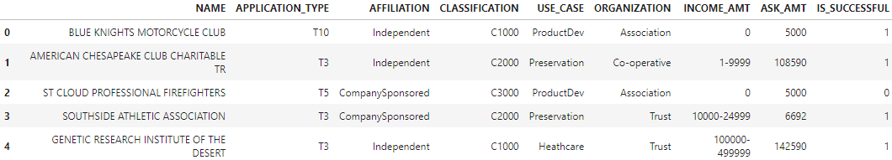
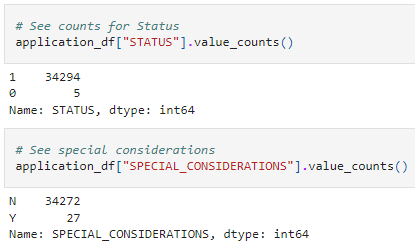

# Alphabet Soup Charity Success Analysis

## Overview

This analysis uses a deep neural network model to predict which charity organizations will best use funds for their proposed projects.

## Results

### Data Preprocessing

- What variable(s) are considered the target(s) for your model?

    The only target variable is the column **IS_SUCCESS**. It is a binary variable, true or false, indicated if the charity successful used the money granted to it.

- What variable(s) are considered to be the features for your model?

    The remaing 8 variables in the above table were used in the final neural network model.

- What variable(s) are neither targets nor features, and should be removed from the input data?

    Three columns, EIN, STATUS, SPECIAL_CONSIDERATIONS, were dropped.
    - EIN was none repeating record identifier and provided no data.
    - STATUS and SPECIAL_CONSIDERATIONS were heavily skewed to one categorical variabl and provided no useful information. 

    

### Compiling, Training, and Evaluating the Model

- How many neurons, layers, and activation functions did you select for your neural network model, and why?

    - Nerons: Selected twice as many neurons as features for each layer so 640 neurons
    - Layers: Attempted to look for primary and secondary features so 2 layers
    - Activation Functions:
        - Hidden Layers: Keep the model simple so Relu
        - Output Layer: Goal of the model is to output a binary value so Sigmoid
- Were you able to achieve the target model performance?
    Yes. The final model reached about 78% accuracy.
- What steps did you take to try and increase model performance?
    Added the names columns back to the features table. Attempted bucketing and recoding. The winning method was bucketing keeping most of the names unchanged.

## Summary

To reach an accuracy of 78%, the model must know the names of the charities. If the names are not provide to the model, the accuracy falls to 73%. 

This would suggest that a neural network model or any time of machine learning is needed. The foundation could just look at its records and see if the requesting charity has been successful in the past. This also implies that this or any model would bias new unknown charities making a request for money as they would have no history in the model.

Given that the data is simple. A logistic regression should work and reduce the time needed to fit the model. Using this model would also allow further analysis of which factors are providing the most weight to the model. For example, could just knowing the name of the charity be enough to identify if it will be successful or not?